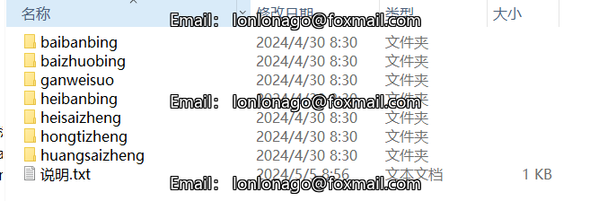
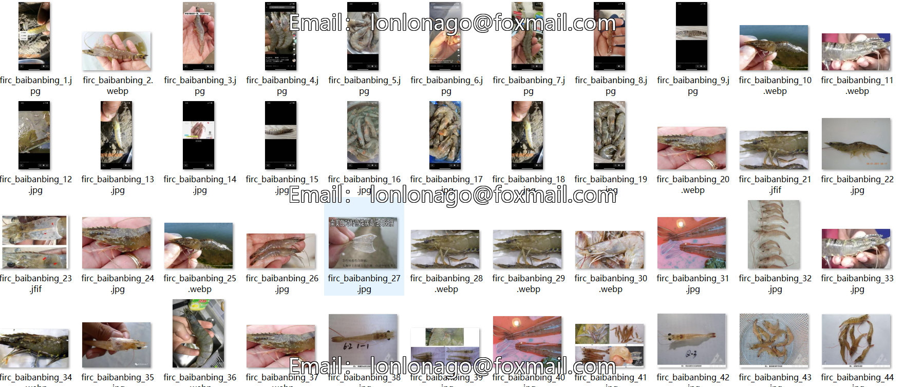
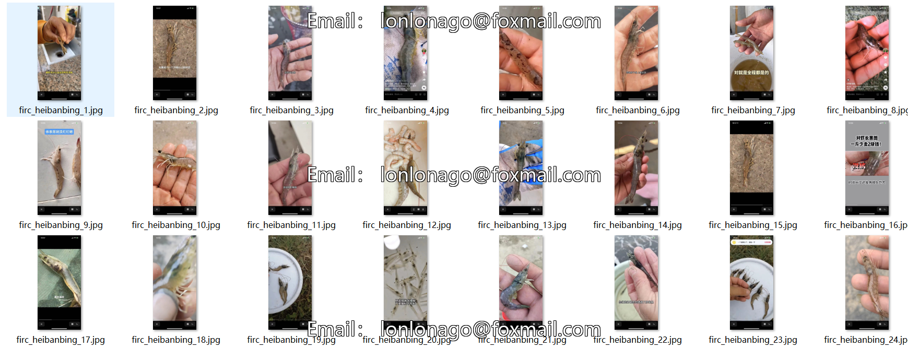

# 【Classification Dataset】Mantis Shrimp Disease Classification Dataset - 889 Images, 7 Classes

## Dataset Description:

This dataset is specifically designed for image classification purposes. It consists of 889 images, each belonging to one of the following seven classes: "baibanbing", "baizhuobing", "ganweisuo", "heibanbing", "heisaizheng", "hongtizheng", and "huangsaizheng". The dataset is exclusively for use in image classification tasks and should not be used for object detection without labeled data.

The dataset format includes only JPEG images, with each class folder containing the corresponding images for that category.

- **Number of Images (JPEG Files)**: 889
- **Number of Classes**: 7
- **Category Names**: ["baibanbing", "baizhuobing", "ganweisuo", "heibanbing", "heisaizheng", "hongtizheng", "huangsaizheng"]

For each category, the number of images is as follows:

- **baibanbing**: 49 images
- **baizhuobing**: 156 images
- **ganweisuo**: 142 images
- **heibanbing**: 166 images
- **heisaizheng**: 119 images
- **hongtizheng**: 160 images
- **huangsaizheng**: 97 images

**Important Notes**: No additional information is provided.

**Special Declaration**: This dataset does not guarantee the accuracy or precision of the trained models or weight files. The dataset is solely intended for accurate and reasonable classification storage.

## Images

---

Here is a pay link on Stripe (https://buy.stripe.com/3cs8yP7sY87d0vu9AB). Please contact me lonlonago@foxmail.com after funding $89, and I will send you a complete data files, thank you!

